<details><summary markdown="span"><code>Contents</code></summary>
* TOC
{:toc}
</details>

# Week 1
### WIP
# Week 2
### WIP
# Week 3
### WIP
# Week 4

## From keypoints to correspondences
### Local patches

* Covariant feature point detectors
    * Location (x, y), scale σ and orientation θ.


* Normalize local patches surrounding keypoints
    * Canonical scale
    * Canonical orientation
        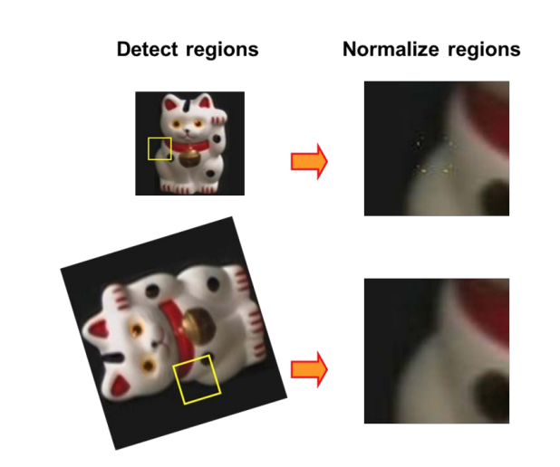

### Estimating canonical orientation

* Find dominant orientation of the image patch
    * This is given by xmax, the eigenvector of M corresponding to λmax  (the larger eigenvalue)
    * Rotate the patch according to this angle

* Orientation from Histogram of Gradients (HoG)
    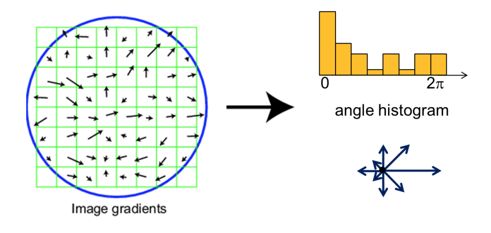

### Local patches

* Covariant feature point detectors
    * Location (x, y), scale σ and orientation θ.


* Normalize local patches surrounding keypoints
    * Canonical scale
    * Canonical orientation
        

* Covariant feature point detectors
    * Affine transformation A

* Normalize local patches surrounding keypoints
    * Canonical affine transformation
        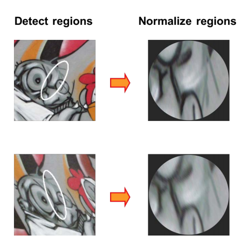

### Overview of point feature matching

1. Detect a set of distinct feature points
2. Define a patch around each point
3. Extract and normalize the patch
4. Compute a local descriptor
5. Match local descriptors

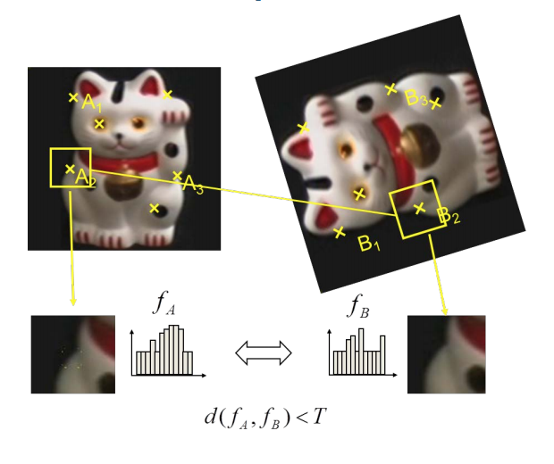

### Feature descriptors

* Simplest descriptor: Vector of raw intensity values

* How to compare two such vectors?
    * Sum of squared differences (SSD)
        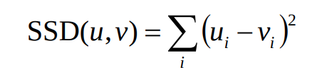

* Normalized correlation
    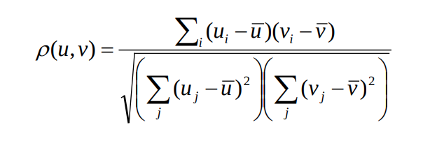


## Feature descriptors

### Histogram of Gradients (HOG) descriptors
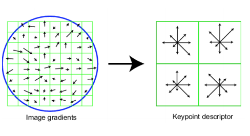

#### SIFT detector
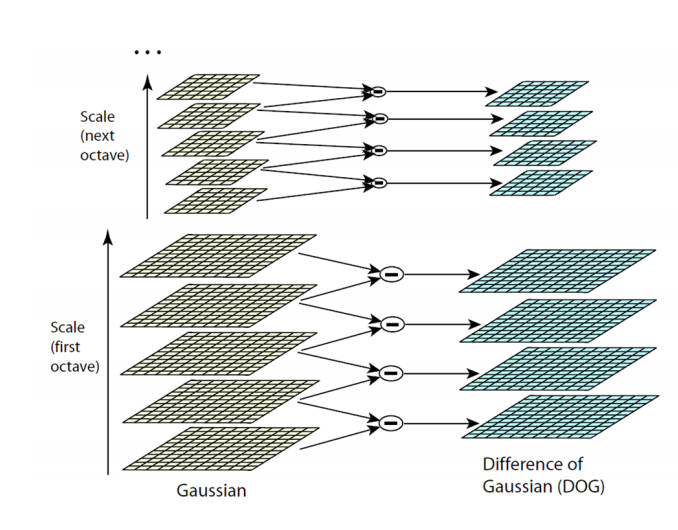
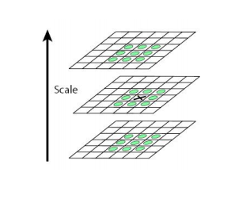

Patch at detected position, scale, orientation
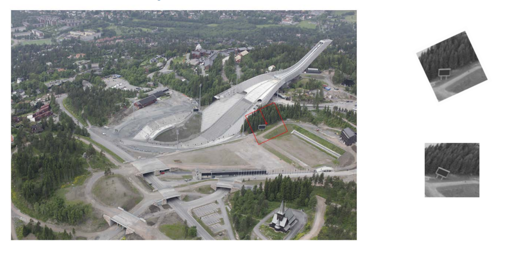

* Extract patch around detected keypoint
* Normalize the patch
to canonical scale and orientation
* Resize patch to 16x16 pixels
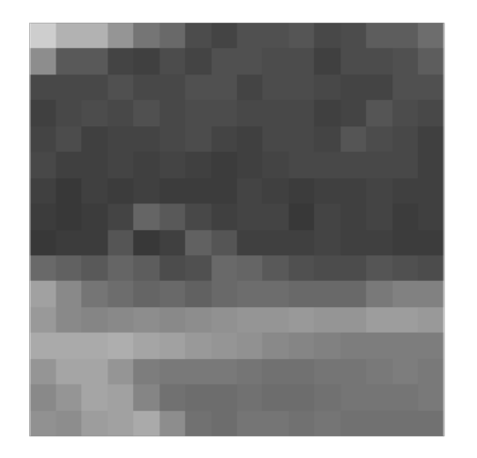
* Compute the gradients
    - Unaffected by additive intensity change

* Apply a Gaussian weighting function
    - Weighs down gradients far from the centre
    - Avoids sudden changes in the descriptor with small changes in the window position
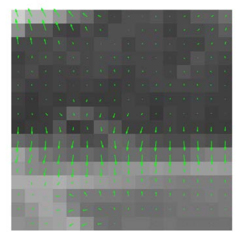
* Divide the patch into 16 4x4 pixels squares
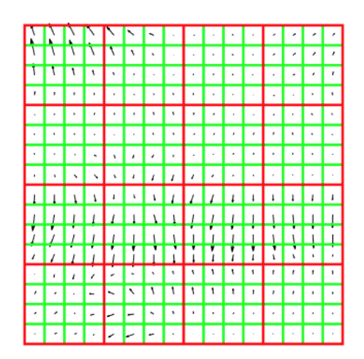
* Compute gradient direction histograms over 8 directions in each square
    - Trilinear interpolation
    - Robust to small shifts, while preserving some spatial information
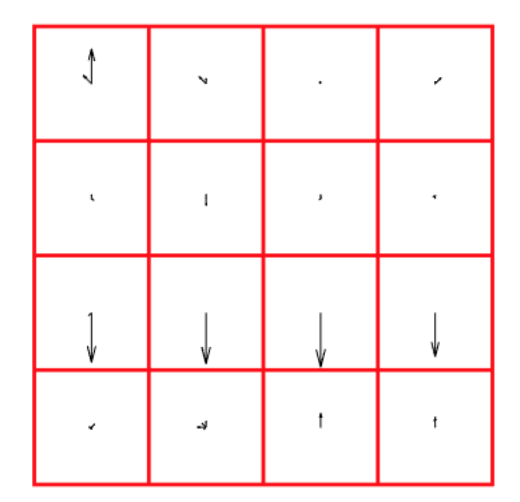
* Concatenate the histograms to obtain
    a 128 dimensional feature vector
* Normalize to unit length
    - Invariant to multiplicative contrast change
* Threshold gradient magnitudes to avoid excessive influence of high gradients
    - Clamp gradients > 0.2
    - Renormalize

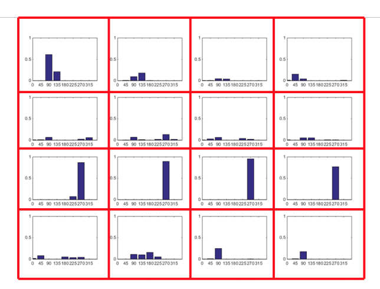
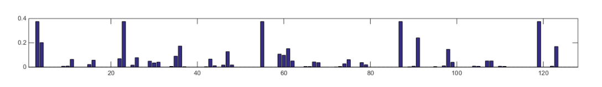
Example: Feature comparison
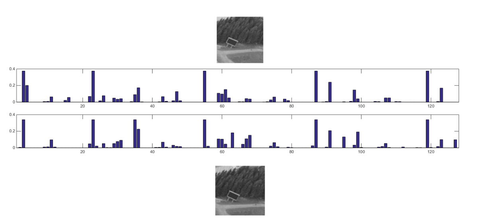
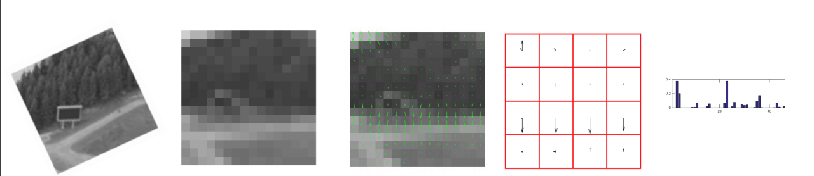
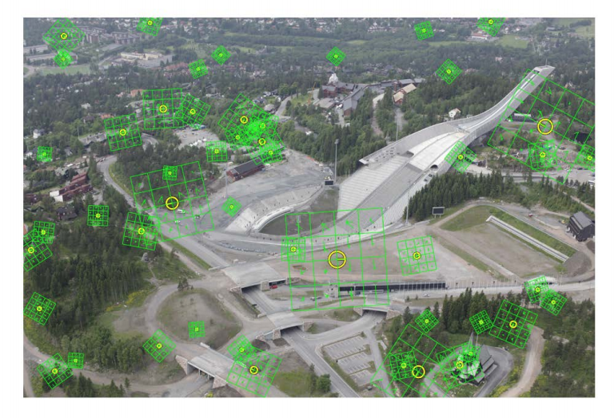
SIFT summary

* Extract a 16x16 patch around detected keypoint
* Compute the gradients and apply a Gaussian weighting function
* Divide the window into a 4x4 grid of cells
* Compute gradient direction histograms over 8 directions in each cell
* Concatenate the histograms to obtain a 128 dimensional feature vector
* Normalize to unit length

### Binary descriptors

* Extremely efficient construction and comparison
* Based on pairwise intensity comparisons
    - Sampling pattern around keypoint
    - Set of sampling pairs
    - Feature descriptor vector is a binary string:
* Matching using Hamming distance:


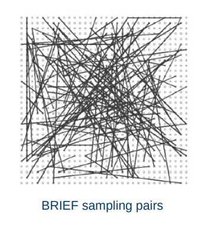
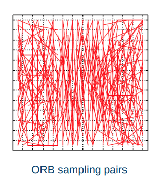

Binary descriptors

* Often achieves very good performance compared to SIFT/SURF
* Much faster than SIFT/SURF

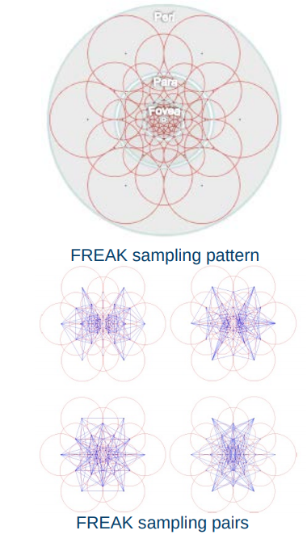

## Feature matching
### Overview of point feature matching
1. Detect a set of distinct feature points
2. Define a patch around each point
3. Extract and normalize the patch
4. Compute a local descriptor
5. Match local descriptors

### Distance between descriptors
* Define distance function that compares two descriptors
    - L1 distance (SAD):
        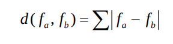
    - L2 distance (SSD):
        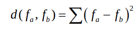
    - Hamming distance:
        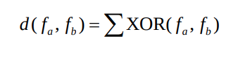

### At which threshold do we get a good match?
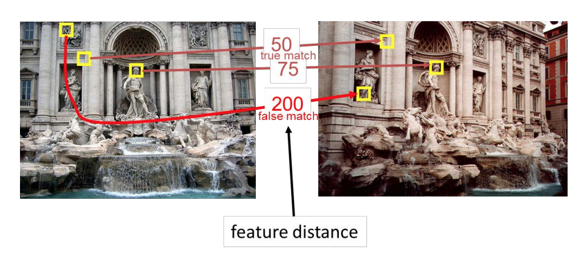

### Evaluating matching performance
AUC: Area Under the Curve
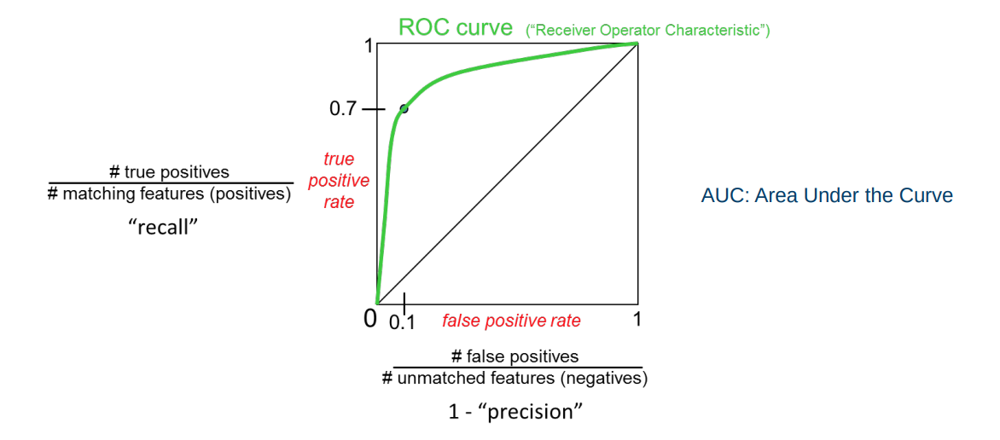

### Matching strategy

* Compare all
* Take the closest
    - Or k closest
    - And/or within a (low) thresholded distance

* Choose the N best putative matches

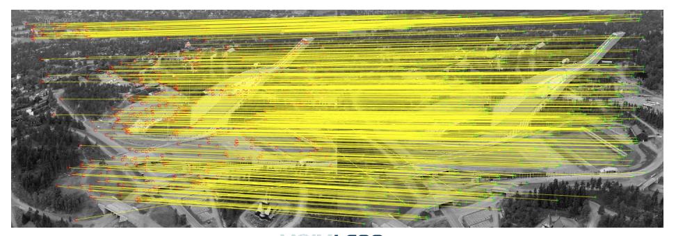
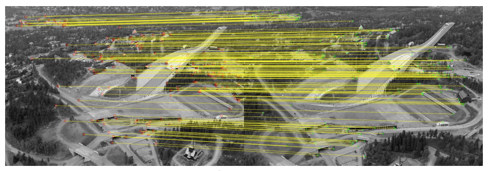

### Which matches are good?
#### Nearest Neighbour Distance Ratio
* For a descriptor $$f_a$$ in $$I_a$$, take the two closest descriptors $$f_b1$$ and $$f_b^2$$ in $$I_b$$
* Perform ratio test: $$\frac{d(fa, fb1)}{d(fa, fb2)}$$
    - Low distance ratio: $$f_b^1$$ can be a good match
    - High distance ratio: $$f_b^1$$ can be an ambiguous or incorrect match
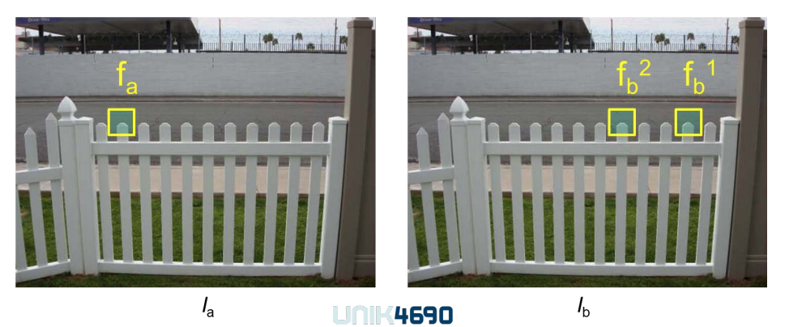
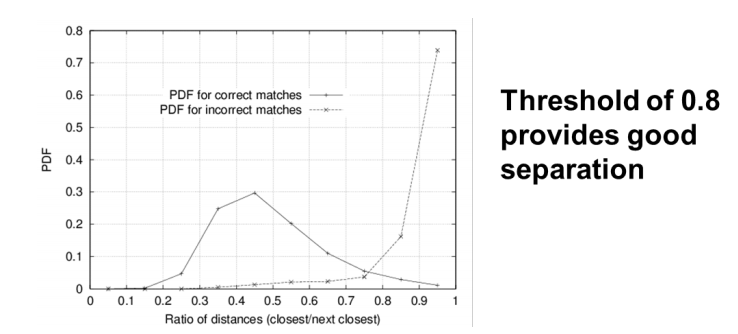

### Example: Holmenkollen
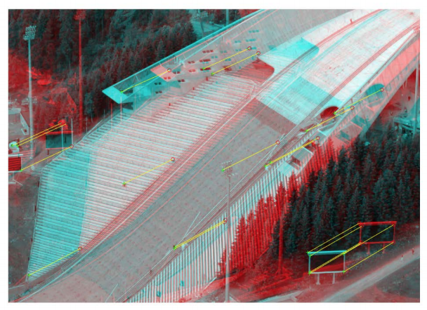
### Cross check test

* Choose matches $$(fa, fb)$$ so that
    - $$fb$$ is the best match for fa in $$Ib$$
    - And fa is the best match for $$fb$$ in Ia

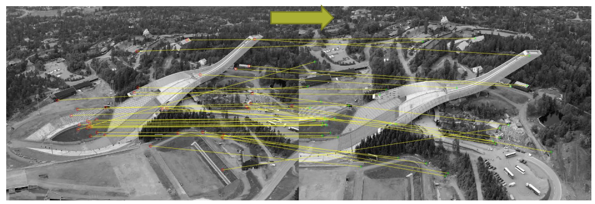
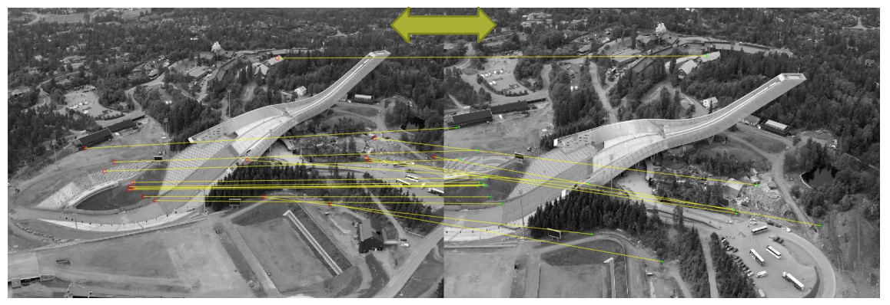
### Matching algorithms
* Comparing all features works well for small sets of images
    - Brute force: BFMatcher in OpenCV
* When the number of features is large, an indexing structure is required
    - For example a k-d tree
    - Training an indexing structure takes time, but accelerates matching
    - FlannBasedMatcher in OpenCV
### Summary
* Matching keypoints
    - Comparing local patches in canonical scale and orientation
* Feature descriptors
    - Robust, distinctive and efficient
* Descriptor types
    - HoG descriptors
    - Binary descriptors
* Putative matching
    - Closest match, distance ratio, cross check
* Next lecture
    - Matches that fit a model


## Estimating homographies from feature

### Homographies induced by central projection

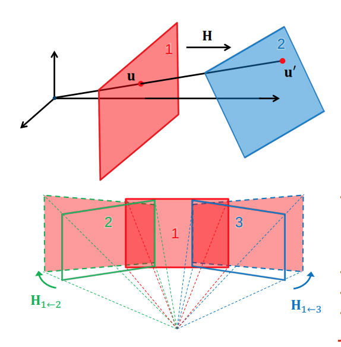

* Point-correspondences can be determined automatically
* Erroneous correspondences are common
* Robust estimation is required to find $$H$$

    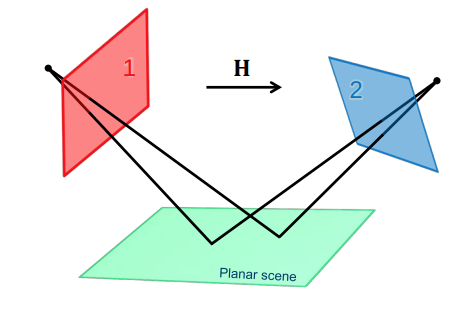

### Estimating the homography between overlapping images

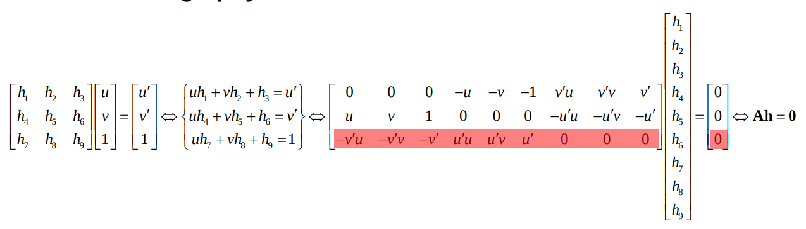

* Establish point correspondences $$u_i ↔  u'_i$$
    - Find key points $$u_i ∈ Img_1$$ and $$u'_i ∈ Img_2$$
    - Represent key points by suitable descriptors
    - Determine correspondences $$u_i ↔ u'_i$$ by matching descriptors
    - Some wrong correspondences are to be expected

* Estimate the homography $$H$$ such that $$u'_i = Hu_i ∀ i$$
    - Robust estimation with RANSAC
    - Improved estimation based on RANSAC inliers

* This homography enables us to compose the images into a
    larger image
    - Image mosaicing
    - Panorama

### Adaptive RANSAC

Objective: To robustly fit a model $$y = f(x;\alpha)$$ to a data set $$S$$ containing outliers

Algorithm
1. Let $$N = ∞, S_{IN} = ∅$$ and $$ #iterations = 0$$
2. while $$N > #interations$$ repeat 3-5
3. Estimate parameters $$\alpha_{tst}$$ from a random n-tuple from S
4. Determine inlier set $$S_t$$ i.e. data points within a distance $$i$$ of the model $$y = f(x;\alpha_{txt})$$
5. If $$\|S_{txt}\| > \|S_{IN}\|$$, set $$S_{IN} = S_{txt}, \alpha = \alpha_{tst}, \omega = \frac{\|S_{IN}\|}{\|S\|}$$ and $$N = \frac{log(1-p)}{log(1-\omega^n)}$$ with $$p = 0.99$$ Increase $$#iteratons$$ by 1

### Estimating the homography
* Estimating the homography in a RANSAC scheme requires
    1. **A basic homography estimation method for 𝒏𝒏 point-correspondences**
    2. A way to determine the inlier set of point-correspondences for a given homography

* The homography has 8 degrees of freedom, but it is custom to treat all 9 entries of the matrix
    as unknowns instead of setting one of the entries to 1 which excludes all potential solutions
    where this entry is 0

### Basic homography estimation


Observe that the third row in A is a linear combination of the first and second row

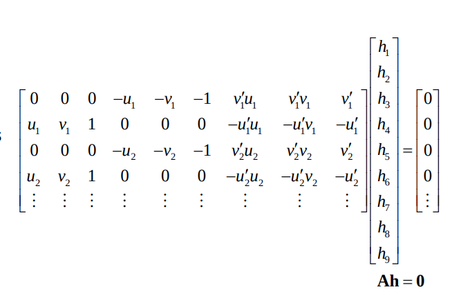

Hence every correspondence $$u_i ↔ u'_i$$contribute with 2 equations in the 9 unknown entries

Basic homography estimation

* Since H (and thus h) is homogeneous, we
    only need the matrix A to have rank 8 in
    order to determine h up to scale

* It is sufficient with 4 point correspondences
    where no 3 points are collinear

* We can calculate the non-trivial solution to
    the equation $$Ah = 0$$ by SVD
    * $$svd(A) = USV^T$$

* The solution is given by the right singular
    vector without a singular value which is the
    last column of V, i.e. $$h = v_9$$

    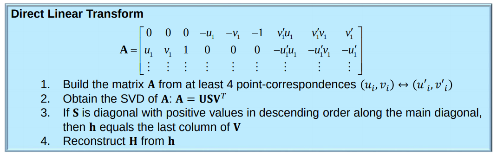

* The basic DLT algorithm is never used with more than 4 point-correspondences
* This is because the algorithm performs better when all the terms of 𝐴𝐴 has a similar scale
    - Note that some of the terms will always be of scale 1
* To achieve this, it is common to extend the algorithm with a normalization and a

    denormalization step

    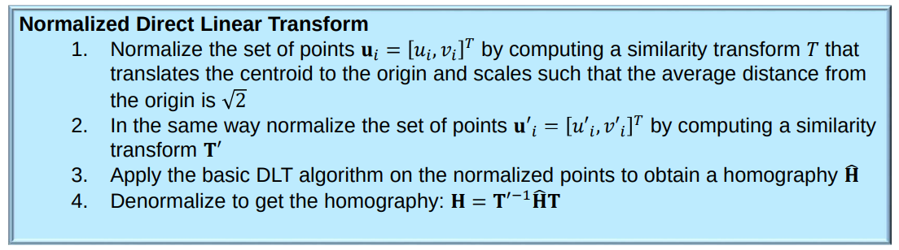

* Estimating the homography in a RANSAC scheme requires
    1. A basic homography estimation method for 𝑖𝑖 point-correspondences
    2. **A way to determine the inlier set of point-correspondences for a given homography**

    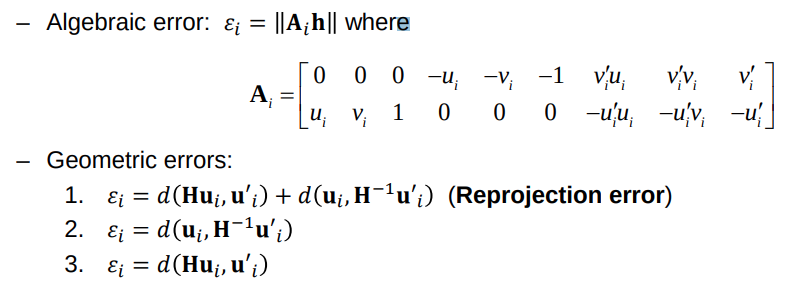
    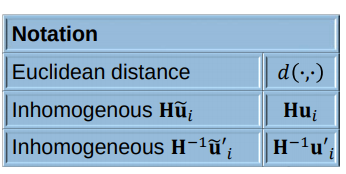

### Robust homography estimation

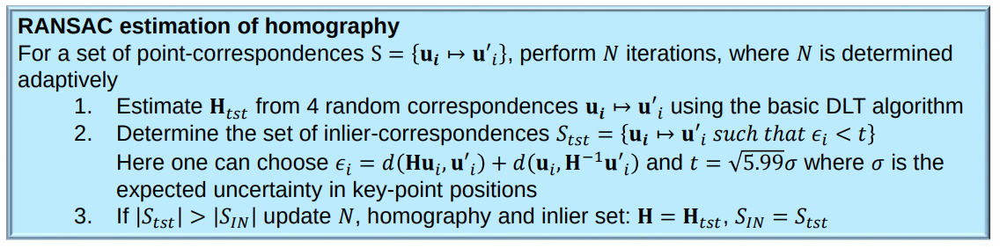

* Finally we would typically re-estimate $$H$$ from all correspondences in $$S_{IN}$$
    - Normalized DLT
    - Minimize $$ϵ = ∑ϵ_i$$ in an iterative optimization method like Levenberg Marquardt

### Image mosaicing

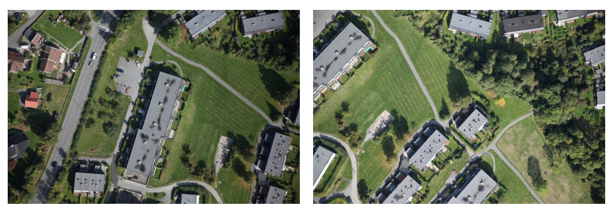
* Let us compose these two images into a larger image

    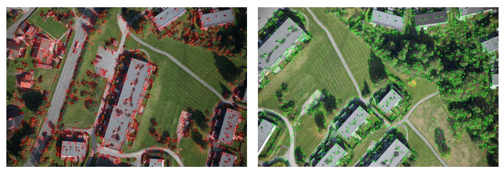
* Find key points and represent by descriptors

    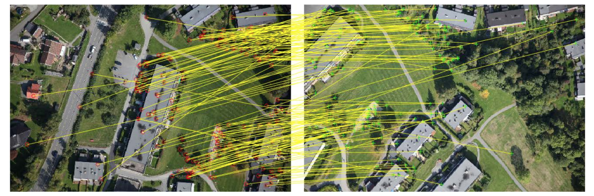
* Establish point-correspondences by matching descriptors
* Several wrong correspondences

    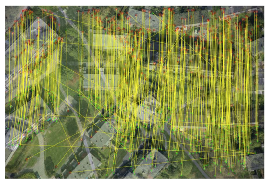
* Establish point-correspondences by matching descriptors
* Several wrong correspondences


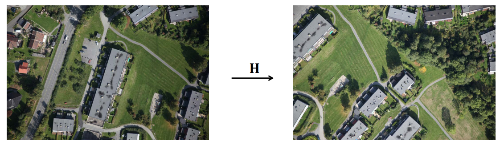
* Estimate homography $$Hũ = ũ'$$
- OpenCV
    ```c++
    #include "opencv2/calib3d.hpp"
    cv::findHomography(srcPoints, dstPoints, CV_RANSAC);
    ```

- Matlab
    ```matlab
    tform = estimateGeometricTransform(srcPoints,dstPoints,’projective’);
    ```
    
* Represent the images in common coordinates  (Note the additional translation!)
- OpenCV
    ```c++
    #include "opencv2/calib3d.hpp"
    cv::warpPerspective(img1, img2, H, output_size);
    ```
- Matlab
    ```matlab
    img2 = imwarp(img1,tform);
    ```

* Now we can compose the images


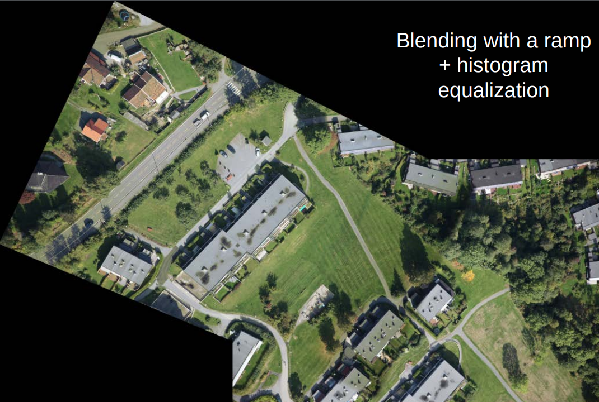
Blending with a ramp + histogram equalization

### SVD
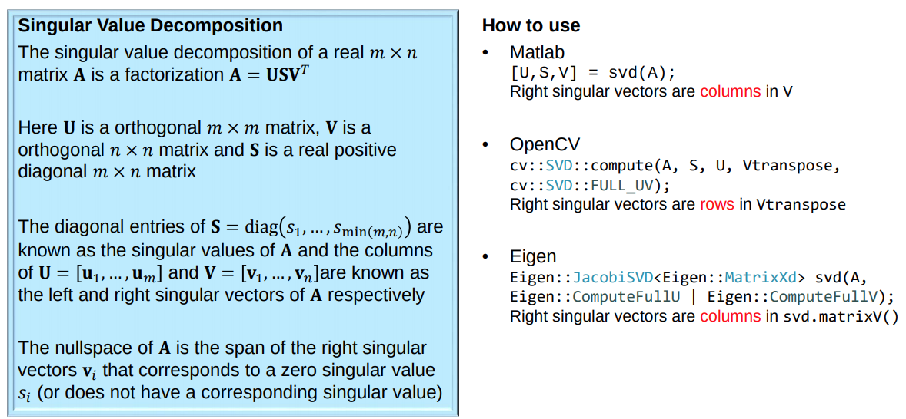
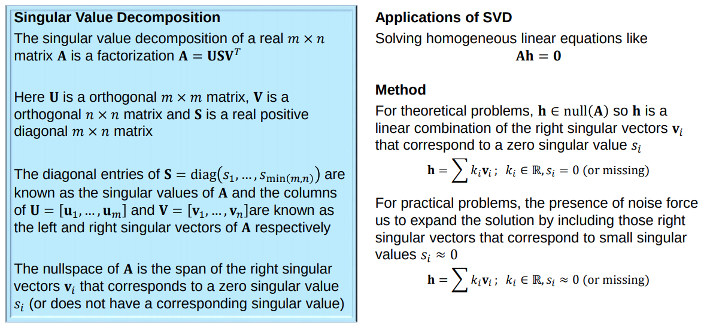


