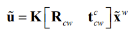
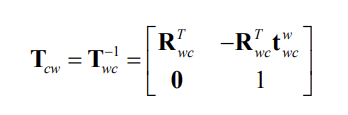
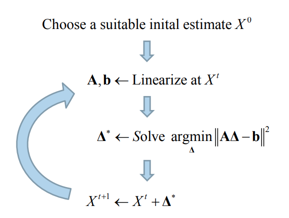
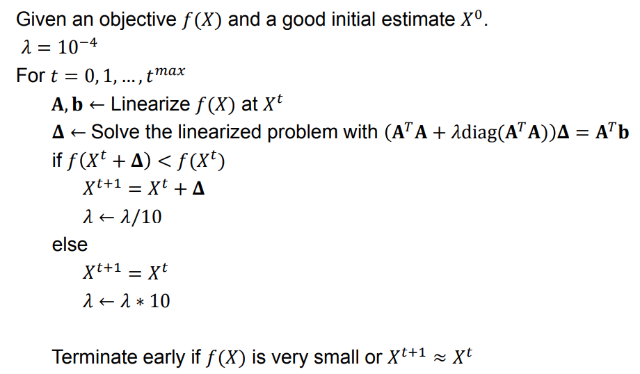
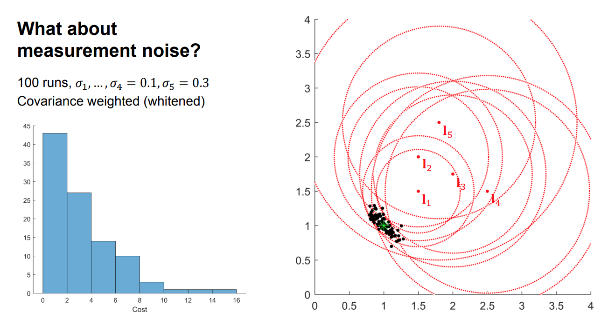

<details><summary markdown="span"><code>Contents</code></summary>
* TOC
{:toc}
</details>

# From keypoints to correspondences

## Local patches

* Covariant feature point detectors
    * Location (x, y), scale σ and orientation θ.


* Normalize local patches surrounding keypoints
    * Canonical scale
    * Canonical orientation
        

# Estimating canonical orientation

* Find dominant orientation of the image patch
    * This is given by xmax, the eigenvector of M corresponding to λmax  (the larger eigenvalue)
    * Rotate the patch according to this angle

* Orientation from Histogram of Gradients (HoG)
    

## Local patches

* Covariant feature point detectors
    * Location (x, y), scale σ and orientation θ.


* Normalize local patches surrounding keypoints
    * Canonical scale
    * Canonical orientation
        

* Covariant feature point detectors
    * Affine transformation A

* Normalize local patches surrounding keypoints
    * Canonical affine transformation
        

## Overview of point feature matching

1. Detect a set of distinct feature points
2. Define a patch around each point
3. Extract and normalize the patch
4. Compute a local descriptor
5. Match local descriptors


## Feature descriptors

* Simplest descriptor: Vector of raw intensity values

* How to compare two such vectors?
    * Sum of squared differences (SSD)
        

* Normalized correlation
    


# Feature descriptors

## Histogram of Gradients (HOG) descriptors


### SIFT detector


Patch at detected position, scale, orientation


* Extract patch around detected keypoint
* Normalize the patch
    to canonical scale and orientation
* Resize patch to 16x16 pixels
    
* Compute the gradients
    - Unaffected by additive intensity change

* Apply a Gaussian weighting function
    - Weighs down gradients far from the centre
    - Avoids sudden changes in the descriptor with small changes in the window position
        
* Divide the patch into 16 4x4 pixels squares
    
* Compute gradient direction histograms over 8 directions in each square
    - Trilinear interpolation
    - Robust to small shifts, while preserving some spatial information
        
* Concatenate the histograms to obtain
    a 128 dimensional feature vector
* Normalize to unit length
    - Invariant to multiplicative contrast change
* Threshold gradient magnitudes to avoid excessive influence of high gradients
    - Clamp gradients > 0.2
    - Renormalize

        
        
        Example: Feature comparison
        
        
        
        SIFT summary

* Extract a 16x16 patch around detected keypoint
* Compute the gradients and apply a Gaussian weighting function
* Divide the window into a 4x4 grid of cells
* Compute gradient direction histograms over 8 directions in each cell
* Concatenate the histograms to obtain a 128 dimensional feature vector
* Normalize to unit length

## Binary descriptors

* Extremely efficient construction and comparison
* Based on pairwise intensity comparisons
    - Sampling pattern around keypoint
    - Set of sampling pairs
    - Feature descriptor vector is a binary string:
* Matching using Hamming distance:

    
    
    

    Binary descriptors

* Often achieves very good performance compared to SIFT/SURF
* Much faster than SIFT/SURF

    

# Feature matching
## Overview of point feature matching
1. Detect a set of distinct feature points
2. Define a patch around each point
3. Extract and normalize the patch
4. Compute a local descriptor
5. Match local descriptors

## Distance between descriptors
* Define distance function that compares two descriptors
    - L1 distance (SAD):
        
    - L2 distance (SSD):
        
    - Hamming distance:
        

## At which threshold do we get a good match?


## Evaluating matching performance
AUC: Area Under the Curve


## Matching strategy

* Compare all
* Take the closest
    - Or k closest
    - And/or within a (low) thresholded distance

* Choose the N best putative matches

    
    

## Which matches are good?
### Nearest Neighbour Distance Ratio
* For a descriptor $$f_a$$ in $$I_a$$, take the two closest descriptors $$f_b1$$ and $$f_b^2$$ in $$I_b$$
* Perform ratio test: $$\frac{d(fa, fb1)}{d(fa, fb2)}$$
    - Low distance ratio: $$f_b^1$$ can be a good match
    - High distance ratio: $$f_b^1$$ can be an ambiguous or incorrect match
        
        

## Example: Holmenkollen

## Cross check test

* Choose matches $$(fa, fb)$$ so that
    - $$fb$$ is the best match for fa in $$Ib$$
    - And fa is the best match for $$fb$$ in Ia

        
        
## Matching algorithms
* Comparing all features works well for small sets of images
    - Brute force: BFMatcher in OpenCV
* When the number of features is large, an indexing structure is required
    - For example a k-d tree
    - Training an indexing structure takes time, but accelerates matching
    - FlannBasedMatcher in OpenCV
## Summary
* Matching keypoints
    - Comparing local patches in canonical scale and orientation
* Feature descriptors
    - Robust, distinctive and efficient
* Descriptor types
    - HoG descriptors
    - Binary descriptors
* Putative matching
    - Closest match, distance ratio, cross check
* Next lecture
    - Matches that fit a model


# Estimating homographies from feature

## Homographies induced by central projection


* Point-correspondences can be determined automatically
* Erroneous correspondences are common
* Robust estimation is required to find $$H$$

    

## Estimating the homography between overlapping images


* Establish point correspondences $$u_i ↔  u'_i$$
    - Find key points $$u_i ∈ Img_1$$ and $$u'_i ∈ Img_2$$
    - Represent key points by suitable descriptors
    - Determine correspondences $$u_i ↔ u'_i$$ by matching descriptors
    - Some wrong correspondences are to be expected

* Estimate the homography $$H$$ such that $$u'_i = Hu_i ∀ i$$
    - Robust estimation with RANSAC
    - Improved estimation based on RANSAC inliers

* This homography enables us to compose the images into a
    larger image
    - Image mosaicing
    - Panorama

## Adaptive RANSAC

Objective: To robustly fit a model $$y = f(x;\alpha)$$ to a data set $$S$$ containing outliers

Algorithm
1. Let $$N = ∞, S_{IN} = ∅$$ and $$ #iterations = 0$$
2. while $$N > #interations$$ repeat 3-5
3. Estimate parameters $$\alpha_{tst}$$ from a random n-tuple from S
4. Determine inlier set $$S_t$$ i.e. data points within a distance $$i$$ of the model $$y = f(x;\alpha_{txt})$$
5. If $$\|S_{txt}\| > \|S_{IN}\|$$, set $$S_{IN} = S_{txt}, \alpha = \alpha_{tst}, \omega = \frac{\|S_{IN}\|}{\|S\|}$$ and $$N = \frac{log(1-p)}{log(1-\omega^n)}$$ with $$p = 0.99$$ Increase $$#iteratons$$ by 1

## Estimating the homography
* Estimating the homography in a RANSAC scheme requires
    1. **A basic homography estimation method for 𝒏𝒏 point-correspondences**
    2. A way to determine the inlier set of point-correspondences for a given homography

* The homography has 8 degrees of freedom, but it is custom to treat all 9 entries of the matrix
    as unknowns instead of setting one of the entries to 1 which excludes all potential solutions
    where this entry is 0

## Basic homography estimation


Observe that the third row in A is a linear combination of the first and second row


Hence every correspondence $$u_i ↔ u'_i$$contribute with 2 equations in the 9 unknown entries

Basic homography estimation

* Since H (and thus h) is homogeneous, we
    only need the matrix A to have rank 8 in
    order to determine h up to scale

* It is sufficient with 4 point correspondences
    where no 3 points are collinear

* We can calculate the non-trivial solution to
    the equation $$Ah = 0$$ by SVD
    * $$svd(A) = USV^T$$

* The solution is given by the right singular
    vector without a singular value which is the
    last column of V, i.e. $$h = v_9$$

    

* The basic DLT algorithm is never used with more than 4 point-correspondences
* This is because the algorithm performs better when all the terms of 𝐴𝐴 has a similar scale
    - Note that some of the terms will always be of scale 1
* To achieve this, it is common to extend the algorithm with a normalization and a

    denormalization step

    

* Estimating the homography in a RANSAC scheme requires
    1. A basic homography estimation method for 𝑖𝑖 point-correspondences
    2. **A way to determine the inlier set of point-correspondences for a given homography**

    
    

## Robust homography estimation


* Finally we would typically re-estimate $$H$$ from all correspondences in $$S_{IN}$$
    - Normalized DLT
    - Minimize $$ϵ = ∑ϵ_i$$ in an iterative optimization method like Levenberg Marquardt

## Image mosaicing


* Let us compose these two images into a larger image

    
* Find key points and represent by descriptors

    
* Establish point-correspondences by matching descriptors
* Several wrong correspondences

    
* Establish point-correspondences by matching descriptors
* Several wrong correspondences


* Estimate homography $$Hũ = ũ'$$
- OpenCV
    ```c++
    #include "opencv2/calib3d.hpp"
    cv::findHomography(srcPoints, dstPoints, CV_RANSAC);
    ```

- Matlab
    ```matlab
    tform = estimateGeometricTransform(srcPoints,dstPoints,’projective’);
    ```
    
* Represent the images in common coordinates  (Note the additional translation!)
- OpenCV
    ```c++
    #include "opencv2/calib3d.hpp"
    cv::warpPerspective(img1, img2, H, output_size);
    ```
- Matlab
    ```matlab
    img2 = imwarp(img1,tform);
    ```

* Now we can compose the images


Blending with a ramp + histogram equalization

### SVD


#  Orientation

* A term describing the relationship between coordinate frames
* Orientation ↔ Rotation
    
    


* The orientation of the camera frame $$F_c$$ with respect to the world
    frame $$F_w$$ can be represented by an orthonormal rotation matrix
    

    

* Special orthogonal group
    

* Construction from orthonormal basis vectors
    

## Principal rotations


## Action on points

* The matrix $$R_{ab}$$ represents the orientation of $$F_b$$ relative
    to $$F_a$$, but it is also a point transformation from $$F_b$$ to $$F_a$$
    given that the frames have the same origin

* A point $$x$$ can be transformed from $$F_b$$ to $$F_a$$ by $$x^a = R_{ab}x^b$$
    

## Composition

* We can chain together consecutive orientations

* If $$R_{ab}$$ is the orientation of $$F_a$$ relative to $$F_a$$ and $$R_{bc}$$ is the
    orientation of $$F_c$$ relative to $$F_b$$, then the orientation of $$F_c$$
    relative to $$F_a$$ is given by $$R_{ac} = R_{ab}R_{bc}$$
    
    
* Issue with numerical precision
    
* Normalization
    

## Other representations

### Euler angles

* Any orientation can be decomposed into a sequence of three principal rotations
    
* The orientation can be represented by the three angles $$(\theta_1,\theta_2,\theta_3)$$  known as Euler angles
    
* Several sequences can be used
    - 
    - To understand Euler angles, we must know the sequence they came from!
    - All sequences have singularities, i.e. orientations where the angles of the sequence are not unique
    - Problematic if we want to recover Euler angles from a rotation matrix

* (roll, pitch, yaw) is often used in navigation to represent the orientation of a vehicle
* The orientation is often described relative to a local North-East-Down (NED) coordinate
    frame $$F_w$$ in the world situated directly below the body frame $$F_b$$
* Then the yaw angle is commonly referred to as «heading» since it corresponds to the compass direction
    - North corresponds to 0°, east 90° and so on

        

* The roll-pitch-yaw sequence $$R_zR_yR_x$$ is singular when $$\theta_2 = \frac{\pi}{2}$$
    

* (roll, pitch, yaw) is practical for vehicles not
    - Most airplanes, cars and ships

* (roll, pitch, yaw) provides an intuitive understanding about the orientation

### Axis angle

* Euler’s rotation theorem states that the most general
    motion of a rigid body with one point fixed is a rotation
    about an axis through that point

* So we can represent any orientation by a pair $$(v, \phi)$$ where
    $$v = [v_1, v_2, v_3]T$$ is the axis of rotation and $$\phi$$ is the angle of rotation
* This representation is intuitive, but typically not used for computations
* The corresponding rotation matrix is
    $$ R_{ab} = cos\phi1 + (1 - cos\phi) vv^T + sin\phi\hat{v} $$
    

### Unit quaternions
* Quaternions are 4D complex numbers  defined by
* Norm:
    

* Unit quaternions $$(\|q\| = 1)$$ is a popular representation for orientation/rotation
* The complex terms are closely related to the axis of rotation, while the real term is closely related to the angle of rotation

    

* Composition $$q_{ac} = q_{ab}q_{bc}$$ is very efficient
    - 16 multiplications and 12 additions
    - Matrix multiplication: 27 multiplications and 18 additions
    - Limited numerical precision ⇒ Normalization (divide by $$\|q\|$$ )


* Inverse of unit quaternions
* Action on point a 𝐱𝐱𝑎𝑎 can be expressed as a product $$p^b = q_{ab}p^aq_{ab}$$
    where points are represented as quaternions with zero real
    term

    

* The rotation matrix corresponding to the unit quaternion
    

## Pros and cons


## Summary


# Pose

* A term describing the relationship between coordinate frames
* Pose = {Position, Orientation}
    

* The pose of the camera frame $$F_c$$  with respect to the world frame
    $$F_w$$ can be represented by the Euclidean transformation matrix
    
    where $$R_{wc} \in SO(3)$$ is a rotation matrix and $$t_{wc}^w \in R^3$$ is a
    translation vector given in world coordinates

    
    

* In illustrations we often represent the pose as an arrow similar to that of the translation vector

## Pose - Invers


## Pose - Action on points


## Pose - Composition
* We can chain together consecutive poses by compounding transformation matrices
    

## Example - Camera on a vehicle in the world


## Example - Image rotation about center


## Summary


# The perspective camera model

A mathematical model that describes the
viewing geometry of pinhole cameras

It describes how the perspective projection
maps 3D points in the world to 2D points in
the image

Combined with a distortion model, the
perspective camera model can describe the
viewing geometry of most cameras


* The pose of the world frame relative to the camera frame,
    denoted by $$T_{cw}$$, is also a point transformation from $$F_w$$ to $$F_c$$

* General perspective camera model
    


* By multiplying $$\Pi_0$$ with $$T_{wc}$$ we get a very compact  expression that is commonly used to represent the perspective camera model

    

* We refer to $$K$$ as the *intrinsic* part and $$[R_{cw} t_{cw}^c]$$ as the
    *extrinsic* part of the perspective camera model

* The matrix $$K[R_{cw} t_{cw}^c]$$ is often denoted by $$P$$ and referred to as camera’s projection matrix
    

* Alternative formulation
    
    where we have used that
    


# Pose from a known 3D map

## Pose estimation

* Pose estimation given a map is sometimes called localization
* In visual localization, this is sometimes also called tracking
    - Tracking the map in the image frames

        

## How can we track a map with a camera?
### Pose from known 3D surface
* Minimize photometric error 
    

* Minimize geometric error (indirect tracking) 
    

###  Pose estimation relative to a world plane
Choose the world coordinate system so that the xy-plane corresponds to a plane $$\Pi$$ in the scene

We can map points on the world plane into image coordinates by using the perspective camera model


⇒ For a calibrated camera, we have a relation between the camera pose and the homography between the world plane and the image!


Assume a perfect, noise-free homography between the world plane and the
image:
Then, because of scale ambiguity:
Since the columns of rotation matrices have unit norm, we can also find a scale factor λ so that the first two columns of *M* get unit norm.
We then have the two possible solutions:
The last column in $$\hat{R}$$ is given by the cross product of the two first columns:
where the sign is chosen so that $$det(\hat{R}) = 1$$
We are now able to reconstruct the camera pose in the world coordinate system for each of the two solutions:


It is in practice simple find the correct solution because only one side of the plane is typically visible
* With a homography estimated from point correspondences, this approach will typically not give proper rotation matrices because of noise
    
* But it is possible to find the closest rotation matrix (in the Frobenius-norm sense) with SVD!
    
    Pose estimation relative to a world plane
    

## Summary
* Direct methods based on minimizing photometric
    error
* Indirect methods based on minimizing geometric
    error
* Homography-based method

# An introduction to nonlinear least squares

## How can solve the indirect tracking problem?

Minimize geometric error with nonlinear least squares!


## Problem formulation


It is often not possible to find an exact solution to this problem.
We can instead seek an approximate solution that minimizes the sum of squares of the residuals


This means that we want to find the 𝐱𝐱 that minimizes the objective
function: 

## Linear least squares
When the equations are linear, we can obtain an objective function on the form

A solution is required to have zero gradient:

This results in the normal equations,

which can be solved with Cholesky- or QR factorization.

## Nonlinear least squares
Nonlinear least squares problems cannot be solved directly, but require an iterative procedure starting from a suitable initial estimate:


We will use nonlinear least squares to solve **state estimation problems** based on *measurements* and corresponding *measurement models*

We say that $$X_i$$ are the state variables involved in measurement $$z_i$$
We are interested in estimating the unknown state variables $$X$$, given the measurements $$Z$$.
The Maximum a Posteriori estimate is given by:


## Nonlinear MAP inference for state estimation
Measurement model:

Measurement prediction function:

Measurement error function:

Objective function:

This results in the nonlinear least squares problem:

It turns out that the nonlinear least squares solution
to this problem is the MAP estimate!

Assume for now that all

This simplifies our objective to:


### Example: Range-based localization


## Linearization

We can linearize all measurement prediction functions $$h_i(X_i)$$ using a simple Taylor expansion at a suitable initial estimate $$X^0$$:

where the measurement Jacobian $$H_i$$ is

and

is the state update vector.


### Solving the linearized problem


### Example: Range-based localization


## Solving the nonlinear problem

We solve the nonlinear least-squares problem by iteratively solving the linearized system:


## The Gauss-Newton algorithm

Gauss-Newton actually approximates the Hessian of the objective $$f(x)$$ as

This approximation is good if we are near the solution and the objective is nearly quadratic.
When the approximation is good:
    - The update direction is good
    - The update step length is good
    - We obtain almost quadratic convergence to a local minimum
When the approximation is poor:
    - The update direction is typically still decent
    - The update step length may be bad
    - The convergence is slower, and we may even diverge

### Example: Range-based localization


## Trust region

* The Gauss-Newton method is not guaranteed to converge
because of the approximate Hessian matrix
* Since the update directions typically are decent,
we can help with convergence by limiting the step sizes
    - More conservative towards robustness, rather than speed
* Such methods are often called trust region methods,
and one example is Levenberg-Marquardt

## The Levenberg-Marquardt algorithm


## Levenberg-Marquardt optimization
 

##Nonlinear MAP inference for state estimation


## What about measurement noise? 


## Weighted nonlinear least squares




## Estimating uncertainty in the MAP estimate
The Hessian at the solution for the weighted problem
is the inverse of the covariance matrix (the information matrix)!

Using our approximated Hessian, we obtain a first order approximation of the true covariance for all states


### Examples


# Optimizing over poses

## Nonlinear state estimation
We have seen how we can find the MAP estimate
of our unknown states given measurements
by representing it as
a nonlinear least squares problem
Δ
Δ AΔ b
, Linearize at tX←A b
argmin ( )
i
m
i i i
X i
X h X∗
=
= −∑ Σz
argmax ( | )MAP
X
X p X Z=
The indirect tracking method
argmin ( )
cw
w
cw cw i i
i
π∗ = −∑
T
T T x u
Minimize geometric error over the camera pose
Rotations and poses are Lie groups
Rotations in 3D:
Poses in 3D:
Rotations and poses are Lie groups
Rotations in 3D:
Poses in 3D:
Rotations and poses
are not vector spaces!
(They lie on manifolds)
Nonlinear state estimation
We have seen how we can find the MAP estimate
of our unknown states give measurements
by representing it as
a nonlinear least squares problem
Δ
Δ AΔ b
, Linearize at tX←A b
argmin ( )
i
m
i i i
X i
X h X∗
=
= −∑ Σz
argmax ( | )MAP
X
X p X Z=
Rotations and poses
are not vector spaces!
(They lie on manifolds)
How do we optimize?
The corresponding Lie algebra
Rotations in 3D:
The corresponding Lie algebra
Rotations in 3D:
Remember the axis-angle representation:
𝜙𝜙
𝐯𝐯
( )cos 1 cos sinTab φ φ φ ∧= + − +R I vv v
The corresponding Lie algebra
Rotations in 3D:
Remember the axis-angle representation:
( )cos 1 cos sinTab φ φ φ ∧= + − +R I vv v 𝜙𝜙
𝐯𝐯
When 𝜙𝜙 is small:
cos 𝜙𝜙 ≈ 1
sin 𝜙𝜙 ≈ 𝜙𝜙
( )cos 1 cos sinTab φ φ φ
φ
∧
∧ ∧
= + − +
≈ + = +
R I vv v
I v I ω
The corresponding Lie algebra
Rotations in 3D:
Remember the axis-angle representation:
𝜙𝜙
𝐯𝐯
When 𝜙𝜙 is small:
cos 𝜙𝜙 ≈ 1
sin 𝜙𝜙 ≈ 𝜙𝜙
The corresponding Lie algebra
Rotations in 3D:
Poses in 3D:
The corresponding Lie algebra
Rotations in 3D:
Poses in 3D:
The corresponding
Lie algebras
are vector spaces!
We can relate the group and algebra through the
matrix exponential and matrix logarithm
Relation between group and algebra
We can relate the group and algebra through the
matrix exponential and matrix logarithm
Relation between group and algebra
Tangent space
The Lie algebra is the tangent space
around the identity element of the group
* The tangent space is the “optimal” space
in which to represent differential quantities related to the group
* The tangent space is a vector space
with the same dimension as the number of degrees of freedom of the group transformations
Dellaert, F., & Kaess, M. (2017). Factor Graphs for Robot Perception
Perturbations
We can represent steps and uncertainty
as perturbations in the tangent space
exp( )∧=T ξ T
exp( )∧=R ω R
Jacobians for perturbations on SO(3)
( )exp( )
[ ]
∧
=
∂ ⊕
= − ⊕
∂
ω 0
ω R x
R x
ω
( )exp( )∧∂ ⊕ ∂ ⊕
= =
∂ ∂
ω R x R x R
x x
⊕ =R x RxGroup action on points:
Jacobians for perturbations on SE(3)
( )
exp( )
[ ]
∧
×
=
∂ ⊕
 = − ⊕ ∂
ξ 0
ξ T x
I T x
ξ
( )exp( )∧∂ ⊕ ∂ ⊕
= =
∂ ∂
ξ T x T x R
x x
⊕ = +T x Rx tGroup action on points:
Summary
* Updates on rotations and poses as perturbations using Lie algebra
* Jacobians for these perturbations
* We are ready to solve
exp( )∧=R ω R
exp( )∧=T ξ T
argmin ( )
cw
w
cw cw i i
i
π∗ = −∑
T
T T x u
Supplementary material
* Ethan Eade, “Lie Groups for 2D and 3D transformations”
* José Luis Blanco Claraco, “A tutorial on SE(3) transformation
parameterizations and on-manifold optimization”
Chapter 7
http://ethaneade.com/lie.pdf
http://ingmec.ual.es/%7Ejlblanco/papers/jlblanco2010geometry3D_techrep.pdf
Lecture 6.3�Optimizing over poses
Nonlinear state estimation
The indirect tracking method
Rotations and poses are Lie groups
Nonlinear state estimation
The corresponding Lie algebra
Relation between group and algebra
Tangent space
Perturbations
Jacobians for perturbations on SO(3)
Jacobians for perturbations on SE(3)
Summary
Supplementary material
PowerPoint Presentation
Lecture 6.4
Nonlinear pose estimation
Trym Vegard Haavardsholm
The indirect tracking method
argmin ( )
cw
w
cw cw i i
i
π∗ = −∑
T
T T x u
Minimize geometric error over the camera pose
This is also sometimes called Motion-Only Bundle Adjustment
Nonlinear state estimation
We have seen how we can find the MAP estimate
of our unknown states given measurements
by representing it as
a nonlinear least squares problem
Δ
Δ AΔ b
, Linearize at tX←A b
argmin ( )
i
m
i i i
X i
X h X∗
=
= −∑ Σz
argmax ( | )MAP
X
X p X Z=
Objective function
Minimize error over the state variable
The optimization problem is
For simpler notation,
we assume that the measurements are pre-calibrated to normalized image coordinates
,argmin ( ( , ))
j
w
wc j n j
X j
X gπ∗ = −∑ ΣT x x
wcX = T
Objective function
Minimize error over the state variable
The optimization problem is
For simpler notation,
we assume that the measurements are pre-calibrated to normalized image coordinates
,argmin ( ( , ))
j
w
wc j n j
X j
X gπ∗ = −∑ ΣT x x
wcX = T
u
n
v
u c
f
v c
f
−
− 
      = =     −    
 
 
u
x K (and distortion…)
Measurement prediction
This gives us the measurement prediction function
ˆ ( ; ) ( ( , ))w wn wc wch gπ= =x T x T x
Measurement prediction
This gives us the measurement prediction function
where
ˆ ( ; ) ( ( , ))w wn wc wch gπ= =x T x T x
( , ) ( )
ˆ1 ˆ( )
ˆ
c
w T w w c c
wc wc wc
c
nc
nc c
n
x
g y
z
xx
yz y
π
 
 = − = = 
  
   
= = =   
  
T x R x t x
x x
(Coordinate transformation)
(Camera model)
Linearization
We can linearize the measurement prediction function
with a local Taylor expansion
where             is a small perturbation in the camera frame.
The measurement Jacobian is given by
( exp( ); ) ( ; )w wwc wch h
∧
∆ ∆≈ +T ξ x T x Fξ
( , )0 0
( exp( ); ) ( exp( ), )( )
c w
wc
w wc
wc wc
c
g
h gπ∧ ∧
== =
∂ ∂∂
= =
∂ ∂ ∂x T xξ ξ
T ξ x T ξ xxF
ξ x ξ
exp( )∧∆ξ
Jacobians
( , ) ( )w T w w cwc wc wcg = − =T x R x t x
( exp( ), )wwcg
∧
=
∂
∂ ξ
T ξ x
ξ
Jacobians
( exp( ), ) ( exp( ))w wwc wcg
∧ ∧ −
= =
∂ ∂ ⊕
=
∂ ∂ξ ξ
T ξ x T ξ x
ξ ξ
( , ) ( )w T w w cwc wc wcg = − =T x R x t x
Jacobians
( exp( ), ) ( exp( ))
(exp( ) )
w w
wc wc
w
wc
g ∧ ∧ −
= =
∧ −
=
∂ ∂ ⊕
=
∂ ∂
∂ − ⊕
=
∂
ξ ξ
ξ
T ξ x T ξ x
ξ ξ
ξ T x
ξ
Jacobians
( exp( ), ) ( exp( ))
(exp( ) )
w w
wc wc
w
wc
w
cw
g ∧ ∧ −
= =
∧ −
=
∧
=
∂ ∂ ⊕
=
∂ ∂
∂ − ⊕
=
∂
∂ ⊕
= −
∂
ξ ξ
ξ
T ξ x T ξ x
ξ ξ
ξ T x
ξ
ξ T x
ξ
Jacobians
( exp( ), ) ( exp( ))
(exp( ) )
[ ]
w w
wc wc
w
wc
w
cw
w
cw
g ∧ ∧ −
= =
∧ −
=
∧
=
∧
×
∂ ∂ ⊕
=
∂ ∂
∂ − ⊕
=
∂
∂ ⊕
= −
∂
 = − − ⊕ 
ξ ξ
ξ
T ξ x T ξ x
ξ ξ
ξ T x
ξ
ξ T x
ξ
I T x
Jacobians
( exp( ), ) ( exp( ))
(exp( ) )
[ ]
w w
wc wc
w
wc
w
cw
w
cw
c
g ∧ ∧ −
= =
∧ −
=
∧
=
∧
×
∧
×
∂ ∂ ⊕
=
∂ ∂
∂ − ⊕
=
∂
∂ ⊕
= −
∂
 = − − ⊕ 
 = − 
ξ ξ
ξ
T ξ x T ξ x
ξ ξ
ξ T x
ξ
ξ T x
ξ
I T x
I x
Jacobians
c
c c
x
z y
π
 
=  
 
x
( , )
( )
c w
wc
c
g
π
=
∂
∂ x T x
x
Jacobians
c
c c
x
z y
π
 
=  
 
x
( , )
wc
c cc
c c c c
g
x z
z y z
π
=
 −∂
=  ∂ − x T x
x
Jacobians
( , )
c w
wc
c cc
c c c c
g
n
x z
z y z
x
d
y
π
=
 −∂
=  ∂ − 
− 
=  − 
x T x
x
cd z
=
Jacobians
( , )0 0
( exp( ); ) ( exp( ), )( )
c w
wc
w wc
wc wc
c
g
h gπ∧ ∧
== =
∂ ∂∂
= =
∂ ∂ ∂x T xξ ξ
T ξ x T ξ xxF
ξ x ξ
Jacobians
( , )0 0
( exp( ); ) ( exp( ), )( )
[ ]
c w
wc
w wc
wc wc
c
g
n c
n
h g
x
d
y
π∧ ∧
== =
∧
×
∂ ∂∂
= =
∂ ∂ ∂
− 
 = −   − 
x T xξ ξ
T ξ x T ξ xxF
ξ x ξ
I x
( , )0 0
( exp( ); ) ( exp( ), )( )
[ ]
c w
wc
w wc
wc wc
c
g
n c
n
n n n n n
h g
x
d
y
d dx x y x y
d dy y x y x
π∧ ∧
== =
∧
×
∂ ∂∂
= =
∂ ∂ ∂
− 
 = −   − 
 − − −
=  − + − − 
x T xξ ξ
T ξ x T ξ xxF
ξ x ξ
I x
Jacobians
Linear least-squares
We can then obtain a linear least-squares problem
,argmin ( ; )
j
w
wc j j n j
j
h
∆
∗
∆ ∆= + −∑ Σξξ T x F ξ x
Linear least-squares
{ }
,
argmin ( ; )
j
w
wc j j n j
j
w
j n j wc j
j
h
∆
∗
∆ ∆
∆
= + −
= − −
∑
Σξ
ξ T x F ξ x
F ξ x T x
We can then obtain a linear least-squares problem
Linear least-squares
We can then obtain a linear least-squares problem
{ }
,
argmin ( ; )
argmin
j
w
wc j j n j
j
w
j n j wc j
j
j j
j
h
∆
∗
∆ ∆
∆
= + −
= − −
= −
∑
Σξ
ξ
ξ T x F ξ x
F ξ x T x
A ξ b
Linear least-squares
We can then obtain a linear least-squares problem
{ }
,
argmin ( ; )
argmin
j
w
wc j j n j
j
w
j n j wc j
j
j j
j
h
∆
∗
∆ ∆
∆
= + −
= − −
= −
∑
Σξ
ξ
ξ T x F ξ x
F ξ x T x
A ξ b
Aξ b
Linear least-squares
With the state update vector
For an example with three points,
the measurement Jacobian A and the prediction error b are
∆ξ
   
   = =   
      
A b
A A b b
A b
Solution to the linearized problem
The solution can be found by solving the normal equations
( )T T∗∆ =A A ξ A b
Δ
Δ AΔ b
, Linearize at tX←A b
Gauss-Newton optimization
Given a good initial estimate      .
For 𝑡𝑡 = 0, 1, … , 𝑡𝑡𝑚𝑚𝑚𝑚𝑚𝑚
𝐀𝐀,𝐛𝐛 ← Linearize at
← Solve the linearized problem with
+ ∗∧
∆←T T ξ
t
wcT
( )T T∗∆ =A A ξ A b∗∆ξ
Example
Pose estimation relative to known 3D points
* n-Point Pose Problem (PnP)
- Typically fast non-iterative methods
- Minimal in number of points
- Accuracy comparable to iterative methods
- Good initial estimates
* Examples
- P3P, EPnP
- P4Pf
* Estimate pose and focal length
- P6P
* Estimates P with DLT
- R6P
* Estimate pose with rolling shutter
Summary
* Pose estimation relative to a world plane
- Pose from homography
* Nonlinear optimization over poses
* Pose estimation relative to known 3D points
- Iterative methods
- PnP
Lecture 6.4�Nonlinear pose estimation
The indirect tracking method
Nonlinear state estimation
Objective function
Measurement prediction
Linearization
Jacobians
Linear least-squares
Solution to the linearized problem
Gauss-Newton optimization
Example
Pose estimation relative to known 3D points
Summary
