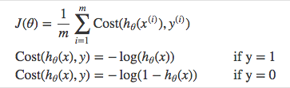
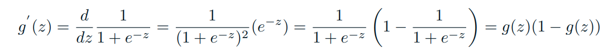
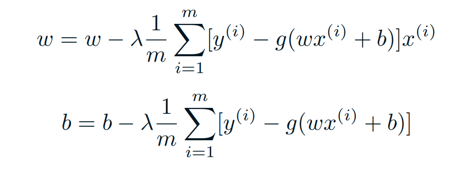

<code>Contents</code>

* TOC
{:toc}

# Week 1

## General image analysis applications
* Object detection
* Instance segmentation
* Variational Autoencoders
* Combining recurrent and convolutuional networks for image captioning 
* Reinforcement learning for games 

## Challanges with deep learning
* Training data: data with known objects used to find the weights in the net
* Validation data: data with known objects used to select architectures and
hyperparameters
* Test data: data with known objects used once to estimate the error rate of the system
* Overfitting to training data
* Working with skewed data
    * When challanged with a dataset that has mostly unimportant classes, and few samples of important classes. How to avoid fitting the model to the unimportant classes, and focus og the small but important classes.

## Introduction to image classification
### Challanges 
* Illumination
* Occlusion
* Deformation
* Background clutter
* Interclass variation

### Measuring similarity between two images
Image F(k,i,j), pixel(i,j) in band k.
* L1-Distance:
$$d_1(i,j) = \sum_k\sum_i\sum_j|F1(k,i,j)-F2(k,i,j)|$$
* L2-Distance(Euclidean distance):
$$d_1(i,j) = \sum_k\sum_i\sum_j\sqrt{F1(k,i,j)^2-F2(k,i,j)^2}$$

### K-nearest-neighbor classification
* Given a set of images $$m$$ training images $$F(i)$$ with true class labels $$y(i), i \in{1, m}$$
* Classification of a new sample $$F(new)$$ is done as follows:
    * Out of the m training images, find the k images with smallest distance (measured by L1 or
    L2)
    * Out of these $$k$$ samples, identify the most frequent class labels
    * Assign the class label the sample as the most frequent class labels among the $$k$$ labels. Denote the predicted class as $$\hat{y}^{(i)}$$
* $$k$$ should be odd, and must be selected a priori (try different values of $$k$$ and choose the one with the lowest classification error using crossvalidation)
* Classification error can be measured by counting the number of samples where the predicted class is equal to the true class $$\hat{y}^{(i)} = y^{(i)}$$

### Selecting K using crossvalidation
For each value of k:
* Cross-validation: split the training data into d subset/folds
* Train on data from d-1 folds ,
* Estimate the accuracy/compute the number of correctly classified images on the last
fold , store the accuracy.
* Repeat this nfold times and compute for the average of the accuracies.
* Repeat with different values of k, select the value that got the highest accuary.
* Using the best value of K, classify the test data set ONCE to get the accuracy of the
classifier

### About KNN-classification
* If k = 1 (1NN-classification), each sample is assigned to the same class as the closest
sample in the training data set.
* If k is very large, this is theoretically a very good classifier.
* This classifier involves no ”training time”, but the time needed to classify one pattern xi will depend on the number of training samples, as the distance to all points in the training set must be computed.
* ”Practical” values for k: 3 ≤ k ≤ 9
* Classification performance should always be computed on the test data set.
* For image classification using the original pixel values as feature values, the results is not invariant to object position, scale, contrast!

### Image Convolution
Common operation in image analysis
* Apply pre-defined filters to enhance or highlight certain features in an image
* Examples:
* Image smoothing using e.g. an averaging filter or a Gaussian filter
* Edge detection by computing the first derivatives
* Point detection and edge locatization using second derivatives
* Classical filters are predefined, but convolutional networks will estimate filters to
locate various shapes in the image

# Week 2

## Metrics
* Precision = TP/(TP + FP)
    * How many positive identifications are actually correct?
* Recall = TP/(TP + FN)
    * What proportion of actual positives are identified correctly? 
* Specificity = TN/(TP+FP)
    * True negative rate, measures how many actual negatives are correctly identified.
* F1 = 2(Precision*Recall)/(Precision+Recall)
    * Harmonic mean between the two.

## Linear regression
* Linear hypotesis $$\hat{y} = wx + b$$ where $$\hat{y}$$ is the prediction and w and b are unknonwn variables that regression will estimate.
* The measure of how well the model fits, i.e error measure or cost function, the data is usually the mean square error for linear regression.
* Loss funciton for linear regression is MSE: $$ \frac{1}{2m}\sum_{i=1}^m(y_i-\hat{y_i})²$$

## Optimisation - Gradient descent
* Find the steepest direction and move until you, hopefully, reach a global minimum.
* Tries to minimize the cost/loss function.
* For a loss function $$J(w,b)$$
    1. Start witch random value of the parameters, e.g $$w = 0, b = 0$$
    2. Compute the loss function for said parameters $$J(0,0)$$
    3. Change w and b in a manner that will decrease $$J(0,0)$$
    4. Repeat step 2-3 until we hopefully end up in a minimum.

* To iteratively minimize J, move in the direction where it decreases fastest, i.e the opposite direction of the gradient.
* Gradient descent propose a new point:

$$w = w - \lambda\nabla_wJ(w,b)$$
$$b = b - \lambda\nabla_wJ(w,b)$$

* $$\theta$$ is the learningrate. To large GD diverges, to small it runs very slow.

### Example:
* $$w$$ and $$b$$ are unknown parameters in the linear model $$y = wx+b$$
* Want to minimize MSE between true and predicted values, $$J(w,b)$$

$$J(w,b) = \frac{1}{2m}\sum_{i=1}^m(\hat{y}^{(i)} - y^{(i)})^2 = \frac{1}{2m}\sum_{i=1}^m(wx^{(i)} + b - y^{(i)})^2$$

* Find the partial derivatives with respect to the parameters:

$$\frac{\partial}{\partial w}J(w,b) = \frac{\partial}{\partial w}\frac{1}{2m}\sum_{i=1}^m(wx^{(i)} + b - y^{(i)})^2 = \frac{(wx + b - y)x}{m}$$

$$\frac{\partial}{\partial b}J(w,b) = \frac{\partial}{\partial b}\frac{1}{2m}\sum_{i=1}^m(wx^{(i)} + b - y^{(i)})^2 = \frac{(wx + b - y)}{m}$$

* Repeat until convegence:

$$w = w - \lambda\frac{\partial J}{\partial W}$$

$$b = b - \lambda\frac{\partial J}{\partial W}$$

## Logistic classification
* Binary regression problem
* A sigmoid function is often used.
* These predictions are descrete(Only specific values are allowed.)
* Types:
    * Binary(Pass/Fail)
    * Multi(Cats, Dogs, Sheep)
    * Ordinal(Low, Medium, High)

### Sigmoid function
$$S(z) = \frac{1}{1+e^{-1}}$$
* 𝑠(𝑧) = output between 0 and 1 (probability estimate)
* 𝑧 = input to the function (your algorithm’s prediction e.g. wx + b)
* 𝑒 = base of natural log

### Cost function - Cross-entropy/Log loss
* Benefits of taking the logarithm are amooth monotonic funcitons, which make it ease to calculate gradient and monimize cost.

### Gradient descent
* For gradient descent of the log likelyhood, one need the derivative of the sigmoid function.

$$ 𝑠′(𝑧)=𝑠(𝑧)(1−𝑠(𝑧))$$

Which leads to an equally beautiful and convenient cost function derivative:

$$ 𝐶′=𝑥(𝑠(𝑧)−𝑦)$$

* 𝐶′ is the derivative of cost with respect to weights
* 𝑦 is the actual class label (0 or 1)
* 𝑠(𝑧) is your model’s prediction
* 𝑥 is your feature or feature vector.

## Softmax Classification and Cross-Entropy cost

* Softmax function calculates the probabilities distribution of the event over ‘n’ different events. 

$$ s(z)_k = \frac{e^{z_k}}{\sum_{i=1}^ne^{z_i}} $$

* $$\sum_ks(z)_k = 1$$
