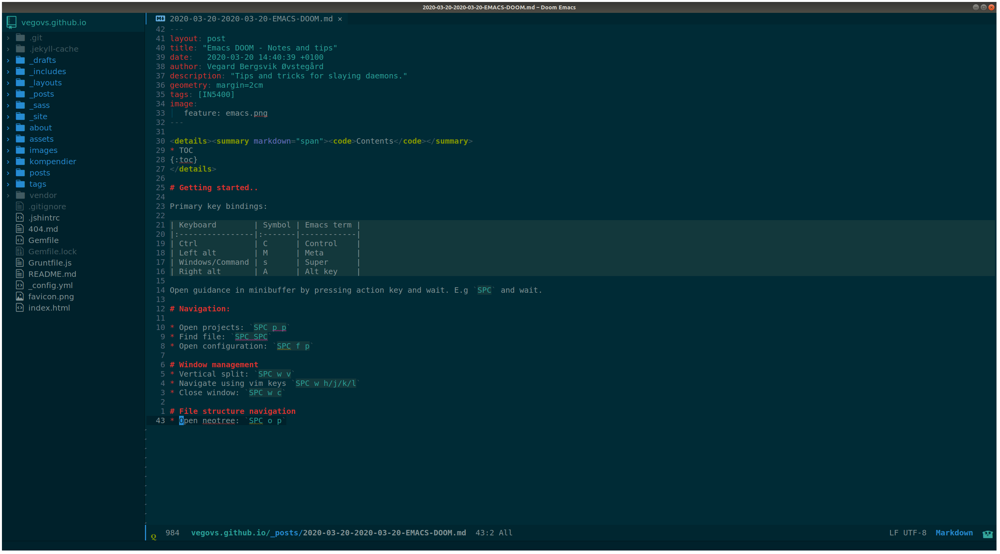
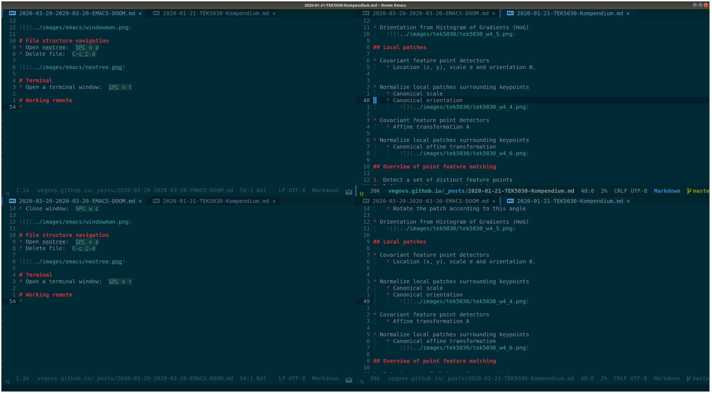

<code>Contents</code>

* TOC
{:toc}

# Getting started..

Go to [doom-emacs](https://github.com/hlissner/doom-emacs) for install guidance.

Primary key bindings:

| Keyboard        | Symbol | Emacs term |
|:----------------|:-------|------------|
| Ctrl            | C      | Control    |
| Left alt        | M      | Meta       |
| Windows/Command | s      | Super      |
| Right alt       | A      | Alt key    |

Open guidance in minibuffer by pressing action key and wait. E.g `SPC` and wait.

## Editing variables
* Press `SPC h v`, search for variable and do your stuff.

# File Navigation and manage projects: 
## File
* Find file: `SPC .`
* Open configuration: `SPC f p`
* Open neotree: `SPC o p`
* Delete file: `C-c C-d`
* Open recent file : `SPC f r`

## Projects
* Open projects: `SPC p p`
* Find file in project: `SPC SPC`
* Open recent file in project: `SPC f R`
* Map projects in a folder: `M-x projectile-discover-projects-in-directory`
    * Maps folder containing .git folder etc.
* Appending `projectile-project-search-path '("~/Projects/")` to `config.el` will
  automatically index projects under `~/Projects/`
  
## Dired
Open a folder instead of a file to open dired-mode.
* More/less info `(/)`
* Move up a directory: `-`
* Enter a directory: `ENT`
* Select for deletion: `d`
* Execute selection: `x`
* Toggle files/folder: `t`
* Sort by name/date: `o`
* Modify modes for group/user: `M`
* Change owner: `O`
* Select all directories: `*\`
* Deselect all: `U`
* Copy file: `C`
* Move: `R`
* Mark : `m`
* Change names with insert-mode: `i`
  
# Window management
* Vertical split: `SPC w v`
* Navigate using vim keys `SPC w h/j/k/l`
* Close window: `SPC w c`
* Reset windows: `SPC =`

# Buffer management
* Switch to workspace-buffer: `SPC b b` or `SPC ,`
* Switch to buffer: `SPC b B`
* Kill a buffer: `SPC b k`
* Create a new buffer: `SCP b N`
* Save a buffer: `SCP b s`

# Editor stuff

## Commenting

* To comment out stuff, use: `g c`
* Visual block: `V j j g c`

## Evil stuff

Like vim-seek, but better? 
* Go to character "h": `f h`
* Go to character before "h": `t h`
* Go to next occurrence: `;`
* Go to previous occurrence: `;`
* Easy motion with: `g s j`
* Search two letter combo: `s $ $`, backwards: `S $ $`

## Avy

Like easy-motion but better?
* Start search with `g s SPC`
    2. Write word end with `RET`
    3. Press the letter where you want to go.

## Evil multi edit

Beyond multi cursor edit
* Select cursor occurrences below: `M-d`
* Select cursor occurrences upwards: `M-d`
Works in visual-mode as well
* Select words etc, use `M-d` or `R` for all occurrences.
* Include/exclude with `RET`

# Searching

* Press `SPC s` to get various search options
* Lookup online with: `SPC s O`
* Lookup cursor online with: `K`
* Search directories in insert-mode with `C-x C-f`

# Org mode

* Cycle through views: `SHIFT TAB`
* Move headings, lines lists etc with: `M-j/k`
* Indent headings, lines lists etc with: `M-h/l`
* To continue a list, press `M-RET`
* Create links: `SPC m l`
* Create code snippets by : `<s TAB`
  * Evaluate code by pressing: `RET` or `C-c C-c` while cursor is inside the snippet.
* To-do hotkeys: `SPC m t`
* Open to-dos: `SPC o a t`
  
# Terminal

* Open a terminal window: `SPC o t`

# Working remote

* 
